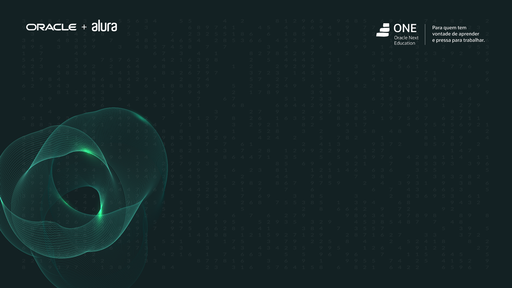
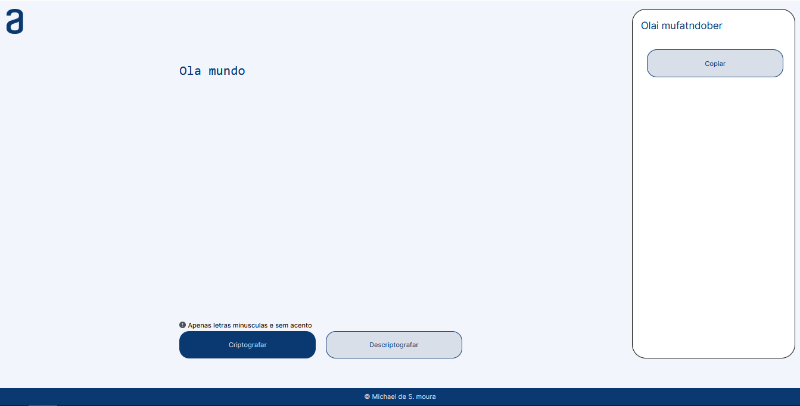
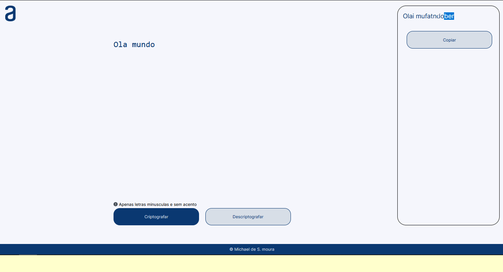

  

# Challenge Oracle Next Education + Alura - Criptografador e Descriptografador de Texto

## 🔎 Descrição do Projeto

Este projeto é uma aplicação web simples que permite aos usuários criptografar e descriptografar textos usando um algoritmo básico de substituição de caracteres. A aplicação foi desenvolvida como parte do desafio do programa Oracle Next Education + Alura, utilizando HTML, CSS e JavaScript.

## 👨‍💻 Funcionalidades

- **Criptografia de Texto:** Substitui caracteres específicos por cadeias de caracteres.
- **Descriptografia de Texto:** Restaura o texto criptografado ao seu estado original.
- **Cópia para a Área de Transferência:** Permite copiar o texto criptografado ou descriptografado para a área de transferência.

## 📚 Tecnologias Utilizadas

- HTML
- CSS
- JavaScript

## 🔭 Estrutura do Projeto

### HTML

O arquivo HTML define a estrutura da aplicação, incluindo o cabeçalho, a área de texto para entrada do usuário, os botões de criptografia e descriptografia, e a área de resultados.

### CSS
O arquivo CSS define o estilo da aplicação, garantindo uma aparência consistente

### JAVASCRIPT
O arquivo JavaScript define as funções que realizam a criptografia, descriptografia e cópia do texto.

### 💡 Como Usar:

- **Interface:**
Digite o texto na área "Digite seu texto". 

 

- **Criptografar:**
Clique em "Criptografar" para criptografar o texto. 

 

 

- **Descriptografar:**
Clique em "Descriptografar" para descriptografar o texto.  

 

 

- **Copiar:**
Clique em "Copiar" para copiar o texto criptografado/descriptografado para a área de transferência.  

 

### Desenvolvido por: &copy; Michael de S. Moura  
# Challenge Oracle Next Education + Alura - Criptografador e Descriptografador de Texto

  

